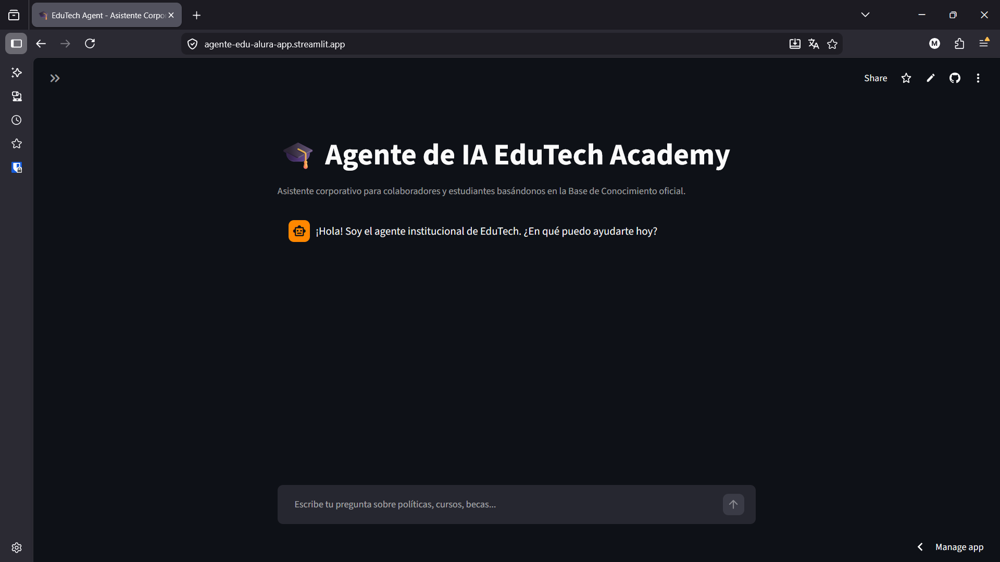
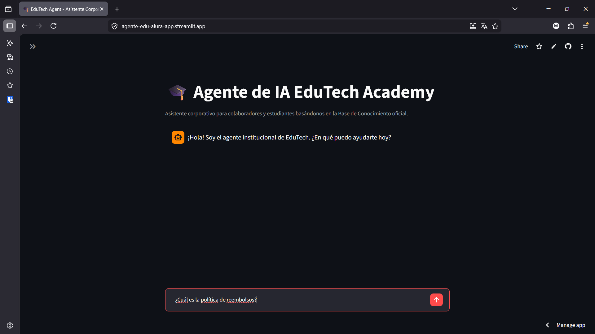
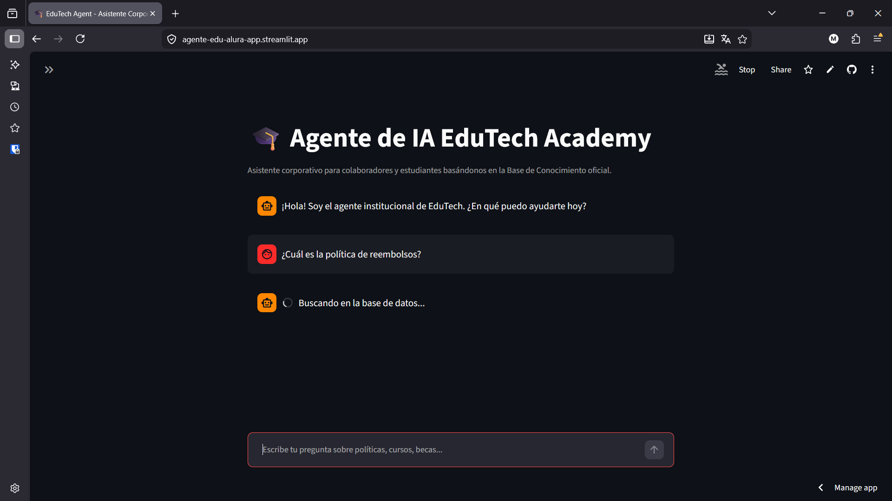
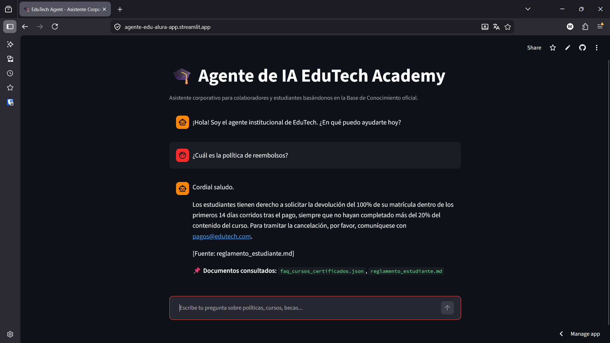

# 🎓 Agente de IA Corporativo - EduTech Academy

¡Bienvenido al repositorio del **Desafío Alura Agentes (Oracle Next Education)**! 

Este proyecto consiste en el desarrollo e implantación de un **Agente de Inteligencia Artificial Corporativo** bajo la arquitectura **RAG (Retrieval-Augmented Generation)**. Su objetivo principal es actuar como una base de conocimiento conversacional centralizada, accesible y disponible para colaboradores y estudiantes de **EduTech Academy**.

---

## 🌐 Aplicación en Vivo (Deploy en la Nube)

🔗 **Acceso a la WebApp Desplegada:** [agente-edu-alura-app.streamlit.app](https://agente-edu-alura-app.streamlit.app)

---

## 📸 Demostración del Agente en Funcionamiento

#### 1. Página inicial 


> **Nota:** La captura muestra la pagina al ingresar a la misma.

#### 2. Cargando consulta


> **Nota:** La captura muestra como debemos ingresar la consulta.

#### 3. Chat analizando consulta


> **Nota:** La captura muestra la consulta cargada y al Agente buscando la respuesta en la base de datos.

#### 4. Chat respondiendo consulta


> **Nota:** La captura muestra la respuesta generada por el agente en la nube a partir del contexto institucional, citando de manera transparente los archivos de origen (`reglamento_estudiante.md`, `faq_cursos_certificados.json`).

---

## 🛠️ Descripción del Dominio y Documentación Procesada

El agente procesa y responde consultas sobre diversos dominios de la organización basados en la carpeta `data/`:

* **Reglamentos y Políticas:** `data/reglamento_estudiante.md` (Asistencia, reembolso, normas).
* **Preguntas Frecuentes:** `data/faq_cursos_certificados.json` (Certificaciones, modalidades).
* **Becas y Financiamiento:** `data/programa_becas.txt` (Descuentos, programa de referidos).
* **Guías Operativas:** `data/guia_uso_plataforma.html` (Navegación e instrucciones).

---

## 🏗️ Arquitectura Técnica y Flujo RAG

El proyecto sigue las 8 etapas fundamentales sugeridas para un pipeline RAG de nivel empresarial:

1. **Ingesta Multiformato:** Soporte para archivos `.md`, `.json`, `.txt` y `.html`.
2. **Procesamiento y Chunking:** Fragmentación dinámica de texto con `RecursiveCharacterTextSplitter` (tamaño de chunk: 500 caracteres, superposición: 50).
3. **Indexación Vectorial:** Vectorización local con `FastEmbed` (`BAAI/bge-small-en-v1.5`) e indexación persistente en `ChromaDB`.
4. **Recuperación Semántica:** Búsqueda top-k de fragmentos relevantes por similitud vectorial.
5. **Generación con LLM:** Integración con **Google Gemini 2.5 Flash** vía el SDK oficial de `google-generativeai`.
6. **Control de Alucinaciones & Fallback:** El prompt restringe al agente a responder **únicamente** con base en la documentación institucional recuperada. Si la información no existe, sugiere el contacto correspondiente.
7. **Interfaz de Usuario:** Construida con `Streamlit` para un diseño ágil, limpio y accesible.
8. **Despliegue y Observabilidad:** Desplegado mediante integración continua en **Streamlit Cloud** con gestión segura de credenciales (`Secrets`).

---

## 💻 Instrucciones para Ejecutar en Local

Si deseas clonar y ejecutar este proyecto localmente:

### 1. Requisitos Previos
* Python 3.12+
* Git
* Una API Key de Google Gemini ([Obtener aquí](https://aistudio.google.com/))

### 2. Instalación y Configuración

```bash
# 1. Clonar el repositorio
git clone [https://github.com/malaspina-martin/agente-edu-alura.git](https://github.com/malaspina-martin/agente-edu-alura.git)
cd agente-edu-alura

# 2. Crear y activar el entorno virtual
py -3.12 -m venv .venv
source .venv/Scripts/activate  # En Windows (Git Bash)

# 3. Instalar dependencias
pip install --no-cache-dir -r requirements.txt

# 4. Lanzar la aplicación
streamlit run src/app.py
```

---

## 📁 Estructura del Proyecto

```bash
agente-edu-alura/
├── data/                       # Base de conocimiento (MD, JSON, TXT, HTML)
│   ├── reglamento_estudiante.md
│   ├── faq_cursos_certificados.json
│   ├── programa_becas.txt
│   └── guia_uso_plataforma.html
├── src/                        # Código fuente
│   ├── __init__.py
│   ├── rag_engine.py          # Pipeline RAG (Indexación, Retrieval, Gemini)
│   └── app.py                 # Interfaz visual de Streamlit
├── .gitignore                  # Archivos excluidos del control de versiones
├── README.md                   # Documentación principal del proyecto
└── requirements.txt            # Dependencias del proyecto
```

---

## 👨‍💻 Autor

Proyecto desarrollado por Martín Malaspina como entregable para el Desafío Alura Agentes / Oracle Next Education (ONE).
